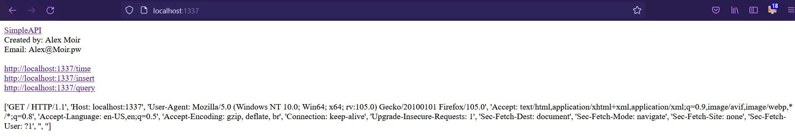
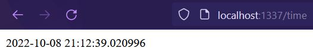
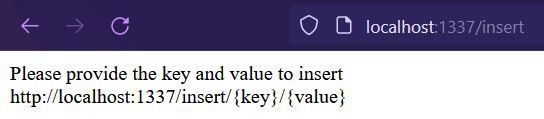
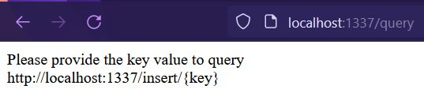

# SimpleAPI
 A very Simple python API

 1. Login at LocaHost:1337
 

 2. Check the time at LocaHost:1337/time
 

 3. Insert a Key and Value at LocaHost:1337/insert
 

3. Retrieve Value with Key at LocaHost:1337/Query
 

